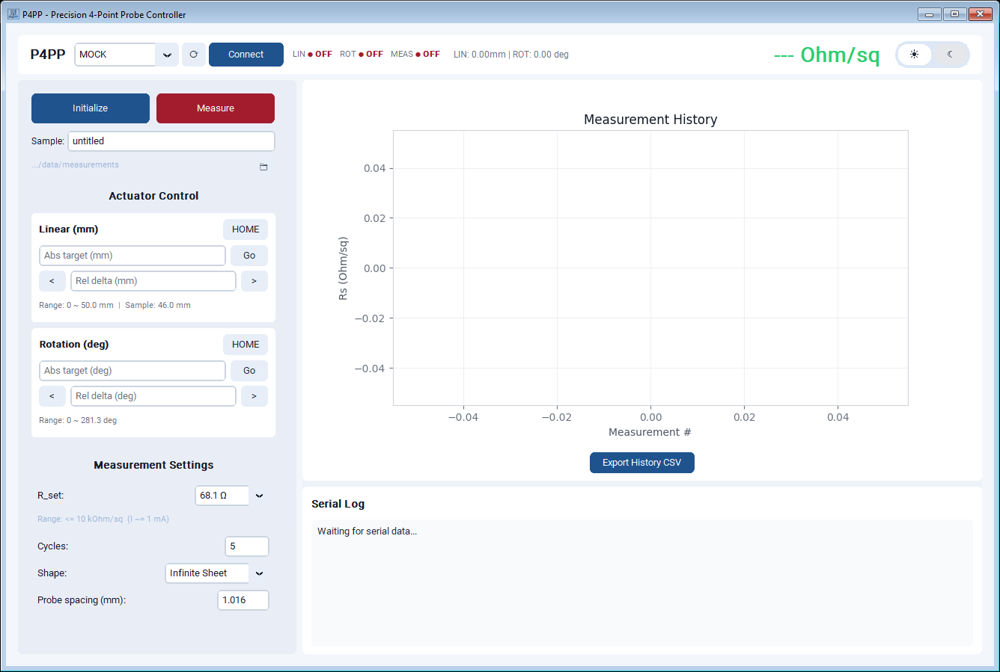

<div align="center">
  
  <h1>P4PP</h1>
  <p><b>Precision 4-Point Probe Controller</b></p>
  <p>Windows GUI for operating a 4-point probe system and logging sheet resistance measurements.</p>
</div>

This repository accompanies **Hwang, Elangovan, Damron, Kwok, Jeon & Diao, "Democratizing Lab Automation through Multi-Agent-Assisted Design and 3D Printing"** (submitted, 2026). Archived release: Zenodo DOI [to be added]. Code is released under the MIT licence; printed-part designs (STL) and documentation may be reused under the same terms with attribution.

---

## Overview

P4PP is the control application for a custom 4-point probe measurement setup.

It provides:

- motion and hardware control through serial communication
- measurement execution (single or multi-cycle)
- live result visualization
- automatic CSV reporting

Target metric: **Sheet Resistance (Rs, Ohm/sq)**.

## Quick Start (1 Minute)

1. Download latest release: https://github.com/polyprintillinois/P4PP/releases/latest
2. In release assets, download `P4PP.zip`.
3. Extract to a stable folder (example: `C:\Tools\P4PP`).
4. Open extracted `P4PP` folder and run `P4PP.exe`.
5. In the app, keep the default `R_set = 681 ohm`, then select `MOCK` and validate `Connect -> Home -> Measure`.

Important:

- Keep the extracted `P4PP` folder structure as-is.
- Do not move `P4PP.exe` outside the `P4PP` folder.

## First run (hello world)

1. For real hardware, flash `firmware/p4pp_firmware/p4pp_firmware.ino` to the Arduino Nano 33 IoT. Connect the 12 V / 60 W adapter (relay coil and stepper drivers) and the USB cable (logic and 3.3 V analog rail).
2. Launch the GUI (`P4PP.zip` from Releases, or `python main.py`) and connect. Without hardware, select `MOCK` in the port list and click **Connect**; this runs the GUI against `src/p4pp/driver/mock_hardware.py`. Click **Initialize**, leave the geometry at **Infinite Sheet**, and click **Measure**. The expected synthetic result is approximately 687 Ω/sq.
3. With real hardware, select the Arduino COM port and click **Connect**. Click **HOME** for both axes (Z probe lift and θ sample rotation), or click **Initialize** to home them in sequence. Each axis should complete a fast switch seek, back-off, and slow re-approach.
4. Insert the 68.1 Ω set resistor (approximately 1 mA), place a reference sample of known sheet resistance (for example, ITO-coated glass), select the sample geometry, and click **Measure**. One delta-mode cycle takes approximately 0.3 s; five cycles are averaged by default (up to 20 may be selected).
5. The reported sheet resistance should fall within `0.90 × R_ref` to `1.10 × R_ref` (the approximately 10% agreement obtained against a commercial four-point-probe system in the paper), with a cycle-to-cycle CV below 0.1%. Re-landing the probe on the same spot should reproduce the value within approximately 2%.
6. Swap in the 681 Ω set resistor (approximately 100 µA) for samples in the kΩ/sq range.

If readings are physically implausible (negative, or identical for forward and reverse polarity), check the DPDT relay wiring: both poles must switch. See the [Analog Wiring Guide](docs/analog_wiring_guide.md).

## Safety

- The probe head descends with approximately 3.3 N total tip force (85 gf × 4) and has sharp tungsten tips. Keep fingers clear of the sample stage while the Z axis is moving, and never reach under the probe head.
- 12 V is present on the driver and relay board; the analog section runs from the 3.3 V rail. Disconnect the adapter before rewiring.
- Do not touch the sample or probe during a measurement cycle. The relay reverses current polarity within each cycle, and contact changes corrupt the reading.
- Handle doped polymer films and dopant solutions (for example, Magic Blue in acetonitrile) with gloves in a fume hood. The instrument itself does not contain solvents.

## App Screenshot



## Highlights

- Live GUI for connect/home/move/measure workflow
- `MOCK` mode for validation without hardware
- Real-time status + graph updates
- Auto-save per-measurement CSV reports
- History CSV export
- Explicit controller state handling

## Hardware Bring-Up (Real Device)

Before using real hardware:

1. Flash firmware: `firmware/p4pp_firmware/p4pp_firmware.ino`
2. Confirm COM port in Windows Device Manager.
3. Complete wiring and calibration checks in docs below.

`R_set` guidance:

- Default startup mode is `681 ohm` (`~0.1 mA`), which is the safer general-purpose option for initial bring-up.
- Switch to `68.1 ohm` (`~1 mA`) for lower-resistance samples such as ITO when you need stronger signal.

Read docs in this order:

1. [4PP Master Guide](docs/4pp_master_guide.md)
2. [Analog Wiring Guide](docs/analog_wiring_guide.md)
3. [Movement Implementation Guide](docs/movement_implementation_guide.md)
4. [App Architecture](docs/app_architecture.md)

## First Real Measurement Checklist

1. Pass full `MOCK` workflow first.
2. Switch to real COM port and connect.
3. Run one low-risk test sample.
4. Confirm graph updates and CSV output in `data/`.

## Troubleshooting

### Serial connection fails

- Recheck COM port in Device Manager.
- Ensure no other application is holding the port.
- Re-test with `MOCK` mode first.

### App does not start (`ModuleNotFoundError: tkinter`)

- Use the official release package (`P4PP.zip`) from Releases.
- If you built locally, use Python 3.11 and rebuild with `P4PP.spec`.

### Measured result stays near `0.00`

- Confirm the Arduino firmware is updated together with the PC app.
- `681 ohm` mode is intended for higher-resistance samples; low-resistance films may require `68.1 ohm`.

### Build/runtime metadata error (`PackageNotFoundError: p4pp`)

- Build with `main.py` as entry script.
- Use the provided `P4PP.spec`.

### Build instability on mixed Python environments

- Build using a clean Python 3.11 virtual environment.
- Clear `PYTHONPATH` before packaging to avoid external site-package contamination.

---

## Developer Notes

### Repository Structure

```text
P4PP/
|- assets/               # logo/icons
|- data/                 # measurement outputs
|- docs/                 # English docs
|- firmware/             # Arduino firmware
|- src/p4pp/             # application source
|- main.py               # app entry point
|- P4PP.spec             # PyInstaller spec
`- setup.py              # package metadata
```

### Local Run

```powershell
py -3.11 -m venv venv
.\venv\Scripts\Activate.ps1
python -m pip install --upgrade pip
pip install -e .
python main.py
```

### Build

```powershell
py -3.11 -m venv build_venv
.\build_venv\Scripts\Activate.ps1
python -m pip install --upgrade pip
python -m pip install pyserial customtkinter matplotlib Pillow pyinstaller
$env:PYTHONPATH = ""
python -m PyInstaller --noconfirm --clean P4PP.spec
```

Output:

- `dist/P4PP/P4PP.exe`
- optional archive: `dist/P4PP.zip`

## Distribution Policy

- `dist/` is **not tracked** in `main` (ignored by `.gitignore`).
- Binaries are distributed via **GitHub Releases assets**.
- `build/` is temporary and can be deleted safely.

## License

P4PP is released under the [MIT License](LICENSE).

Copyright (c) 2026 Changhyun Hwang, Diao Research Group, University of Illinois at Urbana-Champaign.

Validate safety and calibration before production use.
